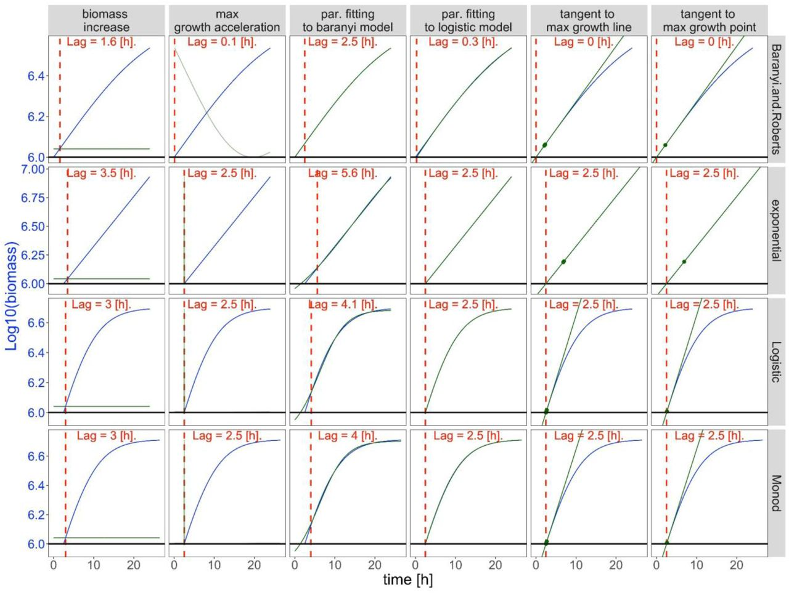

# miLAG: microbial lag phase duration analysis

[](https://github.com/bognabognabogna/microbial_lag_calculator/actions)
[](https://codecov.io/github/mjskay/tidybayes?branch=master)
 


Authors: Bogna J. Smug [][2],
Monika Opalek [][1], 
Maks Nęcki,
Dominika Wloch-Salamon [][3]

[1]: https://orcid.org/0000-0003-1414-901X
[2]: https://orcid.org/0000-0001-9364-163X
[3]: https://orcid.org/0000-0002-0040-1838


[miLAG](https://github.com/bognabognabogna/microbial_lag_calculator) is an R package that
aims to make it easy to calculate microbial lag phase time using 
popular methods + tidying data + ggplot workflow. 


[Shiny](https://dx.doi.org/10.18637/jss.v059.i10) applications are particularly 
convenient for use in a variety of R microbiological data calculation and 
visualization packages. However, when using known modeling libraries like nlsMicrobio or deSolve in R, 
we often have to translate our entry data into a form the model understands, calculate lag phase with
different mathematical methods and then after running the model, translate the 
resulting sample (or predictions) into a more tidy format for use with other R functions. 
`miLAG` aims to simplify these three common (often tedious) operations:

- **Extracting data and choosing the best model**. This often means
 

- **Calculating lag phase duration** from given model. This often means 

`miLAG` also provides some additional functionality for data
manipulation and visualization tasks common to many models:


- **Visualizing microbacteria growth curve and plotting lag**. The focus on




## Supported methods and models

Please note that within this library and README.md "method” refers to the way in which the lag phase is determined, while “model” refers to a set of equations that reproduce the entire microbial growth curve.
`miLAG` aims to support a variety of of mathematical methods calculating microbial lag duration.
Currently supported methods include:
- tangent method,
- max grow acceleration method,
- biomass increase method,
- parameter fitting method,
</br>
While possible supported models are as follows:
- exponential model
- logistic model
- Monod model
- Baranyi model

## Installation

You can install the latest development version from
GitHub with these R commands:

``` r
#install.packages("remotes")
library(remotes)
install_github("https://github.com/bognabognabogna/microbial_lag_calulator", dependencies = TRUE)
```

## Examples

This example shows the use of miLAG with the example dataset;

``` r
library(miLAG)
library(dplyr)


available.methods = list("max growth acceleration",
                         "tangent",
                         "biomass increase",
                         "parameter fitting to a model")
parameters.default = get_def_pars()
my_theme = get_theme(text_size = 22)
```

Imagine this dataset:

``` r
set.seed(5)
example =
  tibble(
    time = c(),
    biomass = rnorm(n * 5, c(0,1,2,1,-1), 0.5)
  )
```


A hierarchical model of this data might fit an overall mean 


### Composing data for input to model: `get_n0`, choose_lag_fit_algorithm_`, `compare_algortithms`


So we can skip right to modeling:

``` r
m =
```

See `vignette("miLAG")` for a variety of additional examples and
more explanation of how it works.

## Feedback, issues, and contributions

We welcome feedback, suggestions, issues, and contributions! Contact us
at <bogna.smug@uj.edu.pl>. If you have found a bug, please file it
[here](https://github.com/bognabognabogna/microbial_lag_calculator/issues/new) with minimal code
to reproduce the issue. Pull requests should be filed against the
[`dev`](https://github.com/bognabognabogna/microbial_lag_calculator/tree/dev) branch.

`miLAG` grew out of helper functions we wrote to make our own lag phase calculation
pipelines tidier. Over time it has expanded to cover more use cases we
have encountered, but we would love to make it cover more!

## Acknowledgements

We would like to thank Wolfram Moebius, Ryszard Korona, Joanna Rutkowska, Aleksandra Walczak, Hanna Tutaj and Adrian Piróg 
for the discussion and their valuable comments. The research was funded by the Priority Research Area BioS under the program 
Excellence Initiative – Research University at Jagiellonian University in Krakow to BJS; by the Polish National Agency of Academic Exchange, 
grant number PPN/PPO/2018/00021/U/00001 to BJS, the programme “Excellence Initiative–Research University” at the 
Jagiellonian University in Kraków, Poland (grant number U1U/W18/NO/28.07) to MO; the National Science Centre, 
Poland, the OPUS grant to D.W.-S. (grant number 2017/25/B/NZ8/01035); the Biology Department research subsidies (grant number N18/DBS/000019 to MO and DWS).

## Citing `miLAG`

Monika Opalek, Bogna J. Smug, Dominika Wloch-Salamon (2023). *How to determine microbial lag phase duration?*. 
R package version 0.0.1, <https://github.com/bognabognabogna/microbial_lag_calculator>.
DOI: [10.1101/2022.11.16.516631](https://doi.org/10.1101/2022.11.16.516631).

## Disclaimer
**miLAG has been developed using the *Dplyr* package in R (R Core Team 2021). Please note the authors take no responsibility for the results. Calculating lags is tricky and the result may not always have a strict biological interpretation.**
