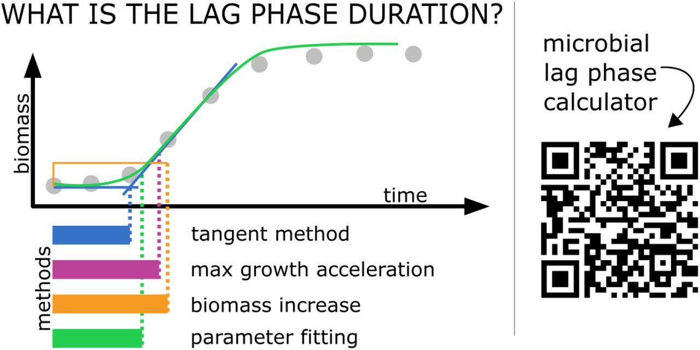

# miLAG: microbial lag phase duration analysis

[](https://github.com/bognabognabogna/microbial_lag_calculator/actions)
[](https://codecov.io/github/mjskay/tidybayes?branch=master)
 


Authors: Bogna J. Smug [][2],
Monika Opalek [][1], 
Maks Nęcki,
Dominika Wloch-Salamon [][3]

[1]: https://orcid.org/0000-0003-1414-901X
[2]: https://orcid.org/0000-0001-9364-163X
[3]: https://orcid.org/0000-0002-0040-1838



## Shiny app: Microbial lag calculator
[Shiny](https://dx.doi.org/10.18637/jss.v059.i10) applications are particularly 
convenient for use in a variety of R microbiological data calculation and 
visualization packages. This is because they are interactive stand-alone tools which do not require any additional software.
We invite to use our shiny web server: 

https://microbialgrowth.shinyapps.io/lag_calulator/ </br>

which allows to calculate microbial lag phase duration using popular methods and various data pre-processing techniques.
The manual can be found [here](https://github.com/bognabognabogna/microbial_lag_calculator/blob/main/shiny_app/lag_calulator/)


## R package: miLAG

For the developper's use we invite to use either the local version of the shiny app 
or the [miLAG](https://github.com/bognabognabogna/microbial_lag_calculator) package which provides a variety of functions that enable lag calculations, and in particular the function: `calc_lag`. 


## Supported methods and models

`miLAG` aims to support a variety of of mathematical methods calculating microbial lag duration.
Currently supported methods include:
- tangent method,
- max grow acceleration method,
- biomass increase method,
- parameter fitting method,
</br>


## Installation

You can install the latest development version of `miLag` package from
GitHub with these R commands:

``` r
#install.packages("remotes")
library(remotes)
install_github("https://github.com/bognabognabogna/microbial_lag_calulator", dependencies = TRUE)
```

and the local vesrion of the shiny application by further running:

``` r
#install.packages("shiny")
library(shiny)
runApp('~/shiny_app/lag_calulator/app.R')
```


## Examples

This example shows the use of miLAG with the example dataset;

``` r
library(miLAG)
available.methods = list("max growth acceleration",
                         "tangent",
                         "biomass increase",
                         "parameter fitting to a model")
parameters.default = get_def_pars()
```

Imagine this dataset:

``` r
time = seq(1,24,0.1)
biomass = if_else(time < 5, 10^5, 10^5*(exp(0.05*(time - 2)))
example =
  tibble(
    time = time,
    biomass = biomass
  )
```

Which can be visualised as a growth curve:
``` r
library(ggplot2)
ggplot(example) + geom_line(aes(x=time, y = biomass)) +
xlab("Time") +
ylab("CFU")
```

And the lag can be calculated and visualised e.g.:

``` r
lag.output = calc_lag(example, method = "tangent", pars = parameters.default)
plot_data(lag.output)
```


See `vignette("miLAG")` for a variety of additional examples and
more explanation of how it works.

## Feedback, issues, and contributions

We welcome feedback, suggestions, issues, and contributions! Contact us
at <bogna.smug@uj.edu.pl>. If you have found a bug, please file it
[here](https://github.com/bognabognabogna/microbial_lag_calculator/issues/new) with minimal code
to reproduce the issue. Pull requests should be filed against the
[`dev`](https://github.com/bognabognabogna/microbial_lag_calculator/tree/dev) branch.

`miLAG` grew out of helper functions we wrote to make our own lag phase calculation
pipelines tidier. Over time it has expanded to cover more use cases we
have encountered, but we would love to make it cover more!
We also invite the scientific community to contribute to further improvements.

## Acknowledgements

We would like to thank Wolfram Moebius, Ryszard Korona, Joanna Rutkowska, Aleksandra Walczak, Hanna Tutaj and Adrian Piróg 
for the discussion and their valuable comments. The research was funded by the Priority Research Area BioS under the program 
Excellence Initiative – Research University at Jagiellonian University in Krakow to BJS; by the Polish National Agency of Academic Exchange, 
grant number PPN/PPO/2018/00021/U/00001 to BJS, the programme “Excellence Initiative–Research University” at the 
Jagiellonian University in Kraków, Poland (grant number U1U/W18/NO/28.07) to MO; the National Science Centre, 
Poland, the OPUS grant to D.W.-S. (grant number 2017/25/B/NZ8/01035); the Biology Department research subsidies (grant number N18/DBS/000019 to MO and DWS).

## Citing `miLAG`

Monika Opalek, Bogna J. Smug, Dominika Wloch-Salamon (2023). *How to determine microbial lag phase duration?*. 
R package version 0.0.1, <https://github.com/bognabognabogna/microbial_lag_calculator>.
DOI: [10.1101/2022.11.16.516631](https://doi.org/10.1101/2022.11.16.516631).

## Disclaimer
**miLAG has been developed using the *Dplyr* package in R (R Core Team 2021). Please note the authors take no responsibility for the results. Calculating lags is tricky and the result may not always have a strict biological interpretation.**
